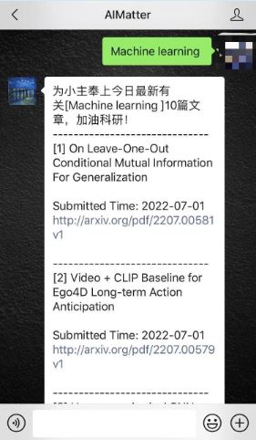

# all-you-need-is-arxiv-search
## 本仓库包含的功能开发

* 一个网站, 包含各个领域最新文章的检索，和任意时间段的研究趋势的分析；

https://www.arxiv.dev 已经上线，包含搜索功能，分领域的论文浏览功能，还有更多数据分析的功能正在开发中。

*  基于微信搜索获取最新arxiv论文推送；

*  通过Telegram bot, 获取最新arxiv论文的推送。

*  本仓库还将开源web app ， 微信bot的开发过程整理成一个教程。

## 包含的3大功能介绍
### Arxiv Search 网站

网址: https://www.arxiv.dev
功能概览：

* 一个搜索框，输入应该是英文单词或者词组，可以根据日期和相关度排序搜索出论文的结果；

*  包含了arxiv上8大学科领域及其子领域的文章，默认排出最新的论文，也可以指定日期输出搜索结果；

* 基于关键词的研究趋势定量分析，和基于时间的论文数量分析（在开发中）。

### 通过微信搜索关键词获取该领域最新投稿文章

* 通过微信公众号ID: AIMatter； 或者扫描下方二维码；

* 进入与该公众号的聊天框，搜索任意英文单词，即可收到该领域最多10篇最新论文的推送。

### Telegram bot
(待开发)

## 欢迎建议
有任何建议可以[提交issue](https://github.com/goodnlp/all-you-need-is-arxiv-search/issues)
